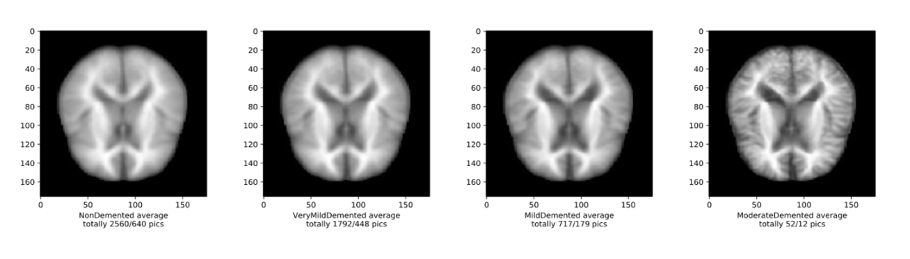

# 🧠 Classifying the Severity of Dementia in Alzheimer’s Disease:
### Using Convolutional Neural Network in a Multiclass Classification Task

a CNN classifying severities of dementia in Alzheimer's disease (4 classes), presenting an accuracy of 0.56.
Developed in 2020.

The CNN obtained an accuracy of 0.56 for predicting stages of severity in Alzheimer’s disease following the tenth epoch (loss value ≈ 1.1), performing well above chance level. Higher accuracies and lower loss values were obtained in the seventh (accuracy ≈ 0.67, loss value ≈ 0.77) and eighth epoch (accuracy ≈ 0.67, loss value ≈ 0.74).
As the CNN produced an accuracy of 0.56 in a multiclass classification task, this presents promising results for further research in the area of classifying the severity of dementia in Alzheimer’s disease using MRI images.

 
The dataset used for this classification has been retrieved from Kaggle and can be found [here.](https://www.kaggle.com/tourist55/alzheimers-dataset-4-class-of-images)

### ✉️ Contact
For further information feel free to connect with one of the authors Matilde Nesheim on [matildenesheim@hotmail.com](mailto:matildenesheim@hotmail.com?subject=[GitHub]%20Dementia-CNN) or on LinkedIn:

[][linkedin]

 

[linkedin]: https://www.linkedin.com/in/matildenesheim
